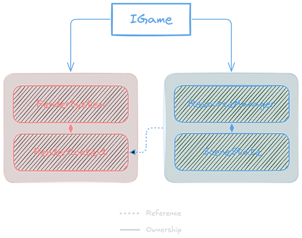

# Engine Architecture

The engine doesn't have a name, so I'll simply be referring to it as `x` since that's the namespace the engine code exists within.

As it currently stands, x is a rather simple forward rendered 3D engine with an Entity Component System (ECS).

The root class of the engine is the [IGame](../Code/Engine/Game.hpp) class. This class is responsible for the following:

1. Initializing and creating the window
2. Initializing the rendering backend ([RenderContext](../Code/Engine/RenderContext.hpp), [RenderSystem](../Code/Engine/RenderSystem.hpp)).
3. Managing the game state ([GameState](../Code/Engine/GameState.hpp))
4. Running the core game loop
5. Shutting down and cleaning up

The engine uses the following structure:



The red blocks on the left side are the **rendering backend** and the blue blocks are the **current scene**. This diagram is simplified for brevity. If you'd like to see the full ownership hierarchy, see [Class Hierarchy](#class-hierarchy).

## Rendering

Most things that need to create resources used for rendering store references to the [RenderContext](../Code/Engine/RenderContext.hpp) owned by IGame, which is a class that holds the Direct3D device and swapchain. The [RenderSystem](../Code/Engine/RenderSystem.hpp) is what's actually responsible for orchestrating the process of rendering a frame, and something only the [IGame](../Code/Engine/Game.hpp) instance interacts with.

> As mentioned above, x uses a forward renderer. This simply means all the lighting calculations are done **per fragment**, and although simple to implement can lead to performance deficits with scenes containing a large number of lights, since each fragment needs to calculate lighting for every light despite the fact that it might not even be visible or within range of said light. The plan for the future is to move to a hybrid forward+/deferred system.

### Passes

The scene is rendered for each pass except for the final post-processing pass, which takes the output of the lit pass and renders that to a fullscreen quad.

1. Shadow pass (depth-only)
    - *For this pass, only the actualy geometry is rendered and no materials are bound to the context.*
2. Fully-lit pass
3. Post-processing pass

All of this is handled by the [RenderSystem](../Code/Engine/RenderSystem.hpp), and can be seen with the following lines of code found in [Game.cpp](../Code/Engine/Game.cpp):

```cpp
_renderSystem->BeginFrame();
{
    // Do our depth-only shadow pass first
    ID3D11ShaderResourceView* depthSRV;
    {
        _renderSystem->BeginShadowPass();
        RenderDepthOnly();
        depthSRV = _renderSystem->EndShadowPass();
    }

    // Do our fully lit pass using our previous depth-only pass as input for our shadow mapping shader
    ID3D11ShaderResourceView* sceneSRV;
    {
        _renderSystem->BeginLightPass(depthSRV);
        RenderScene();
        sceneSRV = _renderSystem->EndLightPass();
    }

    // We can now pass our fully lit scene texture to the post processing pipeline to be processed and displayed on screen
    {
        _renderSystem->PostProcessPass(sceneSRV);
    }
}
_renderSystem->EndFrame();
```

### Materials

! TODO !

### Post Processing

The post-processing system is quite flexible and uses compute shaders for processing. Right now, the engine default processing chain is simply a tonemapper set to ACES by default, which then gets processed by a color grading effect to control brightness, contrast and color balance.

More effects can be added by implementing the [IComputeEffect](../Code/Engine/ComputeEffect.hpp) interface and calling:
```cpp
_postProcess.AddEffect<EffectClass>(params...);

// or

_postProcess.AddEffect<EffectClass>()
    .SetProperty(value)
    .SetAnotherProperty(value); // builder pattern for the nerds out there
```

The order in which you call `AddEffect` determines the order in which the effects get called. Each effect takes the output of the previous effect as input, and this is handled automatically by the post-processing chain.

## Scenes

A recent addition to `x`, scenes contain all the resources and data necessary to render a particular, well... **scene**.

A scene is initially defined in an `.xscn` file ([example](../Game/Scenes/monke.xscn)), which is just a JSON file with a different extension because I didn't feel like reinventing *every* wheel (only most of them). It uses the following schema:

```json
{
    "name": "",
    "description": "",
    "world": {
        "camera": {},
        "lights": {}
    },
    "entities": [
        {
            "id": 0,
            "name": "",
            "components": {
                ...transform, model, etc
            }
        }
    ]
}
```

The IGame instance holds an `activeScene` member which can load and unload these scene descriptors.

### Resources

Any resources the scene needs are loaded using an arena allocator stored by the scene class. This lets all resources live contiguously in the same block of memory, and all the memory can be dropped at once when unloading the scene.

How the resource loading system works is a bit complicated, but different "loader" classes are registered with the ResourceManager owned by the scene, and resource loading is done via calling the correct loader for the type of resource being loaded.

### Loading / Unloading

The process for loading goes like this:

1. Parse the scene descriptor
2. Load resources needed
3. Create entities and attach resources to whatever components needed them

Unload goes like this:

1. Clear entities from SceneState
2. Drop all resource memory (reset arena)

## Class Hierarchy

- [IGame](../Code/Engine/Game.hpp)
    - [RenderContext](../Code/Engine/RenderContext.hpp)
    - [RenderSystem](../Code/Engine/RenderSystem.hpp)
        - [PostProcessSystem](../Code/Engine/PostProcessSystem.hpp)
    - [Scene](../Code/Engine/Scene.hpp)
        - [SceneState](../Code/Engine/SceneState.hpp)
            - [ComponentManager](../Code/Engine/ComponentManager.hpp)
        - [ResourceManager](../Code/Engine/ResourceManager.hpp)
            - [ArenaAllocator](../Code/Engine/ArenaAllocator.hpp)
    - [ScriptEngine](../Code/Engine/ScriptEngine.hpp)

## What *isn't* implemented:

In its current state, this would be better described as a *rendering* engine and not a *game* engine, as rendering has been my focus from the beginning of development, and the part I personally find the most interesting. I haven't even added input handling yet, arguably the most core component of a game.

That being said, this is a list of things that are planned but not currently implemented:

1. Opaque/transparent mesh sorting
2. Soft shadows (PCF)
3. Anti-aliasing of any kind
4. Input handling
5. Lock-free multi-threading
6. Some kind of 3D physics engine (likely Bullet, honestly)

...and a whole hell of a lot more :D